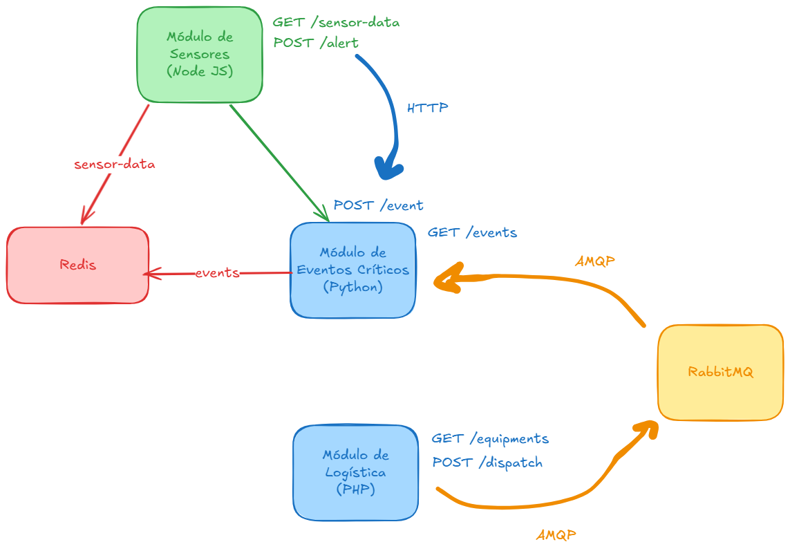

# avaliacao-final-integracao-sistemas

## Visão Geral



## Iniciando as Dependências do Projeto

> Primeiro, precisamos iniciar o Redis e RabbitMQ. Sem eles, as aplicações não sobem.

### Redis

```sh
docker run -p 6379:6379 redis
```

### RabbitMQ

```sh
docker run -p 5672:5672 -p 15672:15672 rabbitmq:management
```

## sensor-service

> Essa API retorna dados de sensores, como também recebe alertas.

### Setup

- Entre na pasta `sensor-service` e instale as dependências do projeto com node.

```sh
npm i
```

- Por fim, rode a aplicação:

```sh
npm run start
```

### Endpoints

```sh
# Busca pelos dados dos sensores disponíveis
curl --location 'localhost:3000/sensor-data'

# Envia um novo alerta.
# IMPORTANTE: o events-service deve estar funcionando para funcionar o envio do alerta.
curl --location 'http://localhost:3000/alert' \
--header 'Content-Type: application/json' \
--data '{
    "id": "meu-terceiro-teste",
    "description": "segue um ultimo evento de teste"
}'
```

### Funcionamento

- No primeiro endpoint (`GET /sensor-data`), buscamos dados fixos no código, em memória, e retornamos ao usuário.
- Quando a primeira busca é feita, os dados são persistidos no Redis.
- Para as próximas buscas, se os dados estão presentes no Redis, retornamos esses (e não os fixos em memória no código).

```js
app.get('/sensor-data', async (req, res) => {
    const sensorDataCache = JSON.parse(await client.get('sensor-data')); // BUSCA NO REDIS
    if (sensorDataCache) return res.send(sensorDataCache); // SE TEM SALVO, RETORNA DO REDIS

    // SE NAO TEM SALVO, BUSCA OS DADOS EM MEMORIA
    const sensorData = getSensorData();

    // SALVA NO CACHE
    await client.set('sensor-data', JSON.stringify(sensorData));
    
    // RETORNA DADOS ENCONTRADOS
    return res.send(sensorData);
});
```

- No segundo endpoint, recebemos um alerta do usuário.
- Ao recebermos esse alerta, fazemos uma requisição http para o events-service (API em Python).
- A API Python recebe e salva o alerta.
- Por fim, devolvemos a resposta retornada pela API Python.

```js
app.post('/alert', async (req, res) => {
    // PEGA DADOS DO CORPO DA REQUISIÇÃO
    const { id, description } = req.body;
    
    // FAZ A REQUISIÇÃO, E PEGA A RESPOSTA FORNECIDA PELO SERVIDOR.
    const response = (await axios.post(URL_EVENTS_SERVICE + '/events', { id, description })).data;

    // DEVOLVE A RESPOSTA DA API PYTHON
    return res.send(response);
});
```

## events-service

> Essa API gerencia eventos, além de consumir de um alerta de equipamentos via rabbitmq.

### Setup

- Entre na pasta `events-service` e instale as dependências do projeto com o pip.

```sh
pip install -r requirements.txt
```

- Por fim, rode a aplicação:

```sh
python app.py
```

### Endpoints

```sh
# Busca por todos os eventos registrados
curl --location 'http://127.0.0.1:5000/events'

# Registra um novo evento
curl --location 'http://127.0.0.1:5000/events' \
--header 'Content-Type: application/json' \
--data '{
    "id": "meu-teste",
    "description": "segue um evento de teste"
}'
```

### Funcionamento

- No primeiro endpoint, buscamos por todos os eventos já registrados.
- Nesse momento, buscamos pelos eventos no Redis.
- Se encontramos, retornamos os resultados do Redis. Se não, retornamos os eventos guardados em 
memória.

```python
# Eventos em memoria
events = {}

# ...
@app.route("/events", methods=["GET"])
def get_events():
    # Buscamos por todos os eventos disponíveis no cache, com o padrão evento-*. Usamos
    # Isso para salvar depois (exemplo: evento-123, evento-super-importante, etc.)
    cached_events = {key: redis_client.get(key) for key in redis_client.keys("evento-*")}
    
    # Se houver no cache, retorne o que encontrou. Se não, retorne o que está em memória.
    return jsonify({"events": cached_events if cached_events else events})
```

- No segundo endpoint, adicionamos mais um evento na lista de eventos.
- Aqui, recebemos o alerta pela API `sensor-service`, no endpoint de alertas.
- Guardamos o novo evento na lista em memória e no redis.

```py
events = {}

@app.route("/events", methods=["POST"])
def add_event():
    # Pegando os dados do corpo da req
    data = request.json
    event_id = data["id"]
    description = data["description"]

    # Salvando na lista em memoria
    events[event_id] = description
    
    # Salvando no redis
    redis_client.set('evento-' + str(event_id), description)

    # Enviando a resposta de sucesso para o sensor-service
    return jsonify({"message": "Evento adicionado!", "event": {"id": event_id, "description": description}}), 201
```

- Além de tudo isso, escutamos atualizações em uma fila do RabbitMQ.
- Para isso, usamos uma outra thread, para receber a mensagem e permitir
que o servidor funcione em paralelo.
- A fila que escutamos será a que o `logistic-service` enviará as mensagens depois.

```py
QUEUE = 'dispatch-messages' # NOME DA FILA QUE VAMOS RECEBER MSGS

# ESSA FUNÇÃO SERA EXECUTADA QUANDO RECEBERMOS UMA NOVA MENSAGEM
def receive_dispatch_alert(ch, method, properties, body):
    print(f"Mensagem recebida do logistic-service: {body.decode()}")

# AQUI, CRIAMOS UMA FUNCAO QUE CONSUMIRA AS MENSAGENS E CHAMARA A FUNCAO ACIMA
def consume():
    connection = pika.BlockingConnection(pika.ConnectionParameters('localhost'))
    channel = connection.channel()
    channel.queue_declare(queue=QUEUE)
    channel.basic_consume(queue=QUEUE, on_message_callback=receive_dispatch_alert, auto_ack=True)
    channel.start_consuming()

if __name__ == "__main__":
    # POR FIM, CRIAMOS UMA THREAD SEPARA PARA ESCUTAR AS MENSAGENS
    thread = threading.Thread(target=consume, daemon=True)
    # ...
```

## logistic-service

> Serviço que retorna equipamentos e envia um alerta para o events-service, usando o RabbitMQ.

### Setup

- Entre na pasta `logistic-service` e instale as dependências do projeto com o composer.

```sh
composer install
```

- Por fim, rode a aplicação:

```sh
php -S 0.0.0.0:4000 -t ./src
```

### Endpoints

```sh
# Busca pelos equipamentos disponíveis
curl --location 'localhost:4000/equipments'

# Envia um alerta (para postar no tópico depois).
curl --location --request POST 'http://localhost:4000/dispatch'
```

### Funcionamento

- No primeiro endpoint, retornamos uma lista estatica de equipamentos:

```php
// SE FOR O ENDPOINT E METODO CORRETOS
if ($request_uri == "/equipments" && $request_method == "GET") {
    // LISTA FIXA DE EQUIPAMENTOS
    $equipmentList = [
        [
            'id' => 1,
            'name' => 'Drilling Rig',
            'description' => 'Heavy-duty rig used for drilling oil wells.',
            'price' => 5000000.00
        ],
        [
            'id' => 2,
            'name' => 'Blowout Preventer',
            'description' => 'Safety device designed to seal the well in case of pressure surges.',
            'price' => 1200000.00
        ],
        [
            'id' => 3,
            'name' => 'Oil Pump',
            'description' => 'Pump system used to extract crude oil from underground reservoirs.',
            'price' => 750000.00
        ]
    ];

    // RETORNA EM JSON
    echo json_encode($equipmentList);
    return;
}
```

- No segundo endpoint, enviamos uma mensagem para a fila do RabbitMQ.
- Essa mensagem será consumida pela events-service, e uma mensagem aparecerá na tela.

```txt
Mensagem recebida do logistic-service: Mensagem logistica urgentissima!!!
```

```php
// SE FOR O ENDPOINT E METODO CORRETOS
if ($request_uri == "/dispatch" && $request_method == "POST") {
    // ABRIMOS CONEXÃO COM O RABBITMQ
    $connection = new AMQPStreamConnection('localhost', 5672, 'guest', 'guest');
    $channel = $connection->channel();

    // USAMOS A FILA DISPATCH-MESSAGES, CONSUMIDA DEPOIS PELO EVENTS-SERVICE
    $channel->queue_declare('dispatch-messages', false, false, false, false);

    // CRIAMOS A MENSAGEM PARA SER ENVIADA
    $msg = new AMQPMessage('Mensagem logistica urgentissima!!!');
    
    // ENVIO DA MENSAGEM DE SUCESSO
    $channel->basic_publish($msg, '', 'dispatch-messages');

    // FECHANDO AS CONEXÕES
    $channel->close();
    $connection->close();

    // RETORNO DA API
    $response = json_encode(["status" => "success", "message" => "Mensagem logistica urgentissima enviada"]);
    echo $response;

    return;
}
```